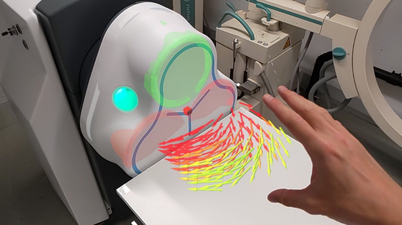

### ✨ About Me

Hi there, I'm Julian Stiefel 👋

I am a Robotics Engineer from Zurich, Switzerland, with 4+ years of experience developing medical software and leading technical projects at a medtech startup. I've graduated from ETH Zurich with a master's degree in Mechanical Engineering, focusing on Robotics. I used to work on multiple projects focusing on robotic perception of the environment, SLAM and kinematic control. I love writing complex algorithms and I mainly do this in C++ and Python.

I have a broad range of interests including robotics, software development, finance, law, literature, triathlon, photography, economy, craftsmanship and being on outdoor adventures. I find my balance by volunteering as a firefighter and contributing to different communities. I have a strong desire to acquire more experience in any area and I am constantly trying to improve myself.

Some of my non-coding projects include building bicycles, crafting furniture or decoration in my own workshop, building fun projects with microcontrollers and working on classic cars. These hands-on projects do not only help me to broaden my horizon, but also give me balance to my daily work.

### 🔗 Connect with Me

  

 
 

### 🛠️ My Languages, Tools and Frameworks

<a href="#">

 
 

### 📈 GitHub Stats

<picture>
  <source media="(prefers-color-scheme: dark)" srcset="https://github-readme-stats-bice-nine-94.vercel.app/api?username=jstiefel&show=reviews&show_icons=true&theme=synthwave&hide_border=true&rank_icon=percentile&hide_rank=true&include_all_commits=true" />
  <source media="(prefers-color-scheme: light), (prefers-color-scheme: no-preference)" srcset="https://github-readme-stats-bice-nine-94.vercel.app/api?username=jstiefel&show=reviews&show_icons=true&theme=default&hide_border=false&rank_icon=percentile&hide_rank=true&include_all_commits=true" />
  
</picture>

<picture>
  <source media="(prefers-color-scheme: dark)" srcset="https://github-readme-stats-bice-nine-94.vercel.app/api/top-langs/?username=jstiefel&size_weight=0.5&count_weight=0.5&langs_count=6&theme=synthwave&hide_border=true&layout=compact&hide=jupyter%20notebook" />
  <source media="(prefers-color-scheme: light), (prefers-color-scheme: no-preference)" srcset="https://github-readme-stats-bice-nine-94.vercel.app/api/top-langs/?username=jstiefel&size_weight=0.5&count_weight=0.5&langs_count=6&theme=default&hide_border=false&layout=compact&hide=jupyter%20notebook" />
  
</picture>

### 👨‍💻 Some Coding Projects 

  
<b>cad-percept - Precise robot localization in architectural 3D plans</b>

   
  I contributed to this project by implementing algorithms for precise robot localization (SLAM) in inaccurate building models and the detection of building deviations between real-time data and mesh models. The pipeline uses the available 3D LiDAR point cloud data of a mobile robotic platform. The new method consistently outperforms the traditional ICP-based alignment, reducing localization errors by at least 30%.
   
   
  Special thanks goes to my talented supervisors @gawela and @hermannsblum for sharing their knowledge!
   
   

  
  

  
   
   

  
<b>Remote magnetic navigation enables precision telesurgery</b>

   
  At Nanoflex Robotics AG, I implemented and maintained the software stack and algorithms to control magnetic devices following ISO 13485 for the treatment of ischemic stroke. Recently, I was working on a field study to allow a surgeon to remotely control our system from any place in the world. I added the necessary features for remote control, data and video transmission using our pre-clinical system. The technology was successfully tested in a study executed together with the Mayo Clinic in Phoenix over a distance of more than 9000 km. A Round-Trip-Time of less than 200 ms was reached.
   
   

  

  
<b>Control of magnetic fields using Mixed Reality</b>

   
  With the release of the HoloLens 2, we had the idea to visualize magnetic fields and control our magnetic field generator using Mixed Reality. I implemented an application using Unity and MRTK. The application was then connected to our existing ROS framework and used with the HoloLens 2.
   
   
  
   
   

  
<b>Real-time logging using InfluxDB and Grafana</b>

   
  Industrial devices usually collect a large amount of sensor data. For critical remote infrastructure, this data should be monitored in real-time to react to issues before they lead to damage. In this project, I implemented a C++ hardware data logger. The data is sent to the real-time, time-series database InfluxDB. The data is then visualized in a Grafana dashboard.
   
   
  
   
   

  
<b>GUI development using Qt and Qml</b>

   
  Although I'm not a user interface designer, I always enjoy creating a GUI once in a while. I designed and developed multiple GUIs for data collection and visualization, but also for device control. I usually use Qt and Qml to separate the design from the backend. In the case shown below, I used Snappy Ubuntu Core and released the complete software as a snap package for the embedded system.
   
   
  
   
   

  
<b>Komoot BLE navigation</b>

   
  The goal of this fun project was to create an inexpensive turn-by-turn-navigation device based on an ESP32 and Komoot's BLE Connect API. Back in 2018, navigation devices for cycling were sparse and expensive.
   
   

  

  
   
   

  
<b>Kinematic control of a 5-DoF intravitreal injection robot</b>

   
  For the startup Ophthorobotics AG, I developed the necessary software and electronics for the kinematic control of their five degree of freedom eye injection robot. As part of this project, I developed several device driver libraries, e.g. for Thorlabs and Maxon. I used inverse kinematics computations to control the end-effector and created a Qt GUI for easier user interaction.
   
   

